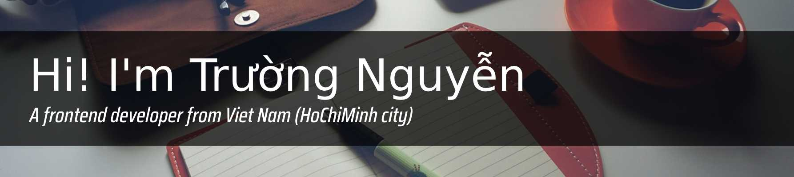

<h3>🤝 Nice to meet you</h3>

As a Frontend developer with 5+ years of experience; I have necessary skills for creating, managing, maintaining and extending the frontend resources. And I regularly do research on more of them. I believe that the creativity, teamwork and enthusiasm that I have will be a part of growing up for the company.

<h3>📗 Education</h3>

- 06/2021 - 06/2022 Sai Gon University

<h3>💼 Work</h3>

- 04 / 2023 - 06 / 2023 [ODA company](http://oda.vn)

- 06 / 2021 - 06 / 2022 [Go2Joy company](https://go2joy.vn)

- 06 / 2018 - 06 / 2021 [Fado (Miczone Group)](https://fado.vn)
  
- 04 / 2017 - 06 / 2018 [Vietry Co.,LTD](https://vietry.com.vn)

<h3>👨‍💻 Personal Projects</h3>

08/2022 - current

- Config and struct project using Webpack, Vue / React and Typescript. This project will help :
  - Provide configuration to optimize performance using Webpack (better chunk splitting, compression, formatting, syntax checking, and commit checking)
- Config and struct project using Vite, Vue / React and Typescript
  - Provide configuration to optimize performance using Vite (better chunk splitting, compression, formatting, syntax checking, and commit checking)
- Create and integrate Web Scraping (using Puppeteer) into above projects. This project will help :
  - Automation in optimizing search engine rankings, thereby optimizing the website's competitiveness.
  - Easy to integrate and provide SSR capability, automatic SEO optimization for technologies that use pure client-side rendering techniques such as Vue, React.
 
<h5>Project repositories:</h5>

1. [Webpack, Vue and Typescript](https://github.com/anhchangvt1994/webpack-project--template-vue-ts__react-router)
2. [Webpack, React and Typescript](https://github.com/anhchangvt1994/webpack-project--template-react-ts__react-router)
3. [Vite, Vue and Typescript](https://github.com/anhchangvt1994/vite-project--template-vue-ts__react-router)
4. [Vite, React and Typescript](https://github.com/anhchangvt1994/vite-project--template-react-ts__react-router)
5. [Automation SEO - Webpack, Vue and Typescript](https://github.com/anhchangvt1994/webpack-project-template-vue__seo-web-scraping)
6. [Automation SEO - Webpack, React and Typescript](https://github.com/anhchangvt1994/webpack-project-template-react__seo-web-scraping)
7. [Automation SEO - Vite, Vue and Typescript](https://github.com/anhchangvt1994/vite-project-template-vue__seo-web-scraping)
8. [Automation SEO - Vite, React and Typescript](https://github.com/anhchangvt1994/vite-project-template-react__seo-web-scraping)

<h5>Note :</h5>

The personal projects I listed above belong to the group of projects that build tools to support frontend developers (website). It provides convenience, optimization, stability, and time-saving for developers, helping them focus more on Business  Logic, UI, and UX code. There are always templates available on the market like this, for example, when using Vue there will be VueCLI, React will have Create React App, even Vite has a repository of templates for you to choose from. And these personal projects of mine are exactly the "wheel" in the phrase "why are you reinventing the wheel?", but I am proud that I know how to make the best quality wheels for myself, and hopefully for many more people.

If you are interested in knowing more about UI/UX projects that I have participated in, you can check out the websites that I have attached in the introduction of my work process at companies, specifically at Fado and Go2joy. And some freelancer websites that I will list below.

<h3>👨‍💻 Freelancer and UI/UX Projects</h3>

1. [ShopTocXinh](http://shoptocxinh.vn) - HTML, CSS, Javascript and JQuery for UI/UX
2. Opia is a personal UI/UX project, this project contains a design created by myself, and UI/UX by myself
  - [Design](https://github.com/anhchangvt1994/opiatheme)
  - [UI/UX code](https://github.com/anhchangvt1994/opia) 
3. [FVNBox JQuery plugins](https://github.com/anhchangvt1994/fvnBox). This project is also a "wheel" and I have created it with all the passion of my youth, when I was just starting out in the profession.
4. [VietKiem 3D](http://id.vietkiem3d.vn) - NextJS 13, styled-components, yup, React Hook Form for UI/UX

<h3>Connect information</h3>

📫 How to reach me **anhchangvt1994@gmail.com**

📄 Need [**My CV**](https://docs.google.com/document/d/1xEp9OLR6-Pdo3Hp7sOFTDQDF5Gey7kgKdEajv-vTjtw/edit?usp=sharing)

📞 Need my phone number **+8(494) 862-1519**

<h3>Social information</h3>

<h3 align="left">Languages and Tools:</h3>

&nbsp;
&nbsp;
&nbsp;
&nbsp;
&nbsp;
&nbsp;
&nbsp;
&nbsp;
&nbsp;
&nbsp;

&nbsp;

