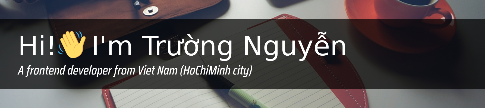

 

> :sunny: By failing to prepare, you are preparing to fail.
>  
> :sunny: Even if you expect to fail, it's still better to try than to give up.

<i>Benjamin Franklin and Robin Sharma</i>

<!-- <h1 align="center">  Nice to meet you</h1> -->

## My skills

#### Most Used
         

#### Commonly Used
   

#### Less Used

   

## :technologist: Personal Projects

1. [Dynamic Rendering Ultra Generation](https://github.com/anhchangvt1994/webpack-project-template-vue__seo-web-scraping) - Webpack, Vue, Typescript, Express, Fastify, uWebSockets and Puppeteer
2. [Dynamic Rendering Ultra Generation](https://github.com/anhchangvt1994/webpack-project-template-react__seo-web-scraping) - Webpack, React, Typescript, Express, Fastify, uWebSockets and Puppeteer
3. [Dynamic Rendering Ultra Generation](https://github.com/anhchangvt1994/vite-project-template-vue__seo-web-scraping) - Vite, Vue, Typescript, Express, Fastify, uWebSockets and Puppeteer
4. [Dynamic Rendering Ultra Generation](https://github.com/anhchangvt1994/vite-project-template-react__seo-web-scraping) - Vite, React, Typescript, Express, Fastify, uWebSockets and Puppeteer
5. [Light-house auto optimization service](https://github.com/anhchangvt1994/web-scraping-seo-service) - Typescript, Express, Fastify, uWebSockets and Puppeteer

6. [Web-Frontend boilerplate](https://github.com/anhchangvt1994/webpack-project--template-vue-ts__vue-router) - Webpack, Vue and Typescript
7. [Web-Frontend boilerplate](https://github.com/anhchangvt1994/webpack-project--template-react-ts__react-router) - Webpack, React and Typescript
8. [Web-Frontend boilerplate](https://github.com/anhchangvt1994/vite-project--template-vue-ts__vue-router) - Vite, Vue and Typescript
9. [Web-Frontend boilerplate](https://github.com/anhchangvt1994/vite-project--template-react-ts__react-router) - Vite, React and Typescript

**Short description:**

The product provides a Frontend Web architecture that optimizes performance, saving time and costs and significantly enhances SEO capabilities for websites with full client-side rendering, improving user experience.

##### The High-light features :
  - Runtime config variable, auto-import, Splitting chunks, Compression resources, ESM external resource.
  - Formatter, Code-lint, Pre-commit-lint.
  - Dynamic-rendering - Significantly improves SEO capabilities for fully client-side rendered websites.
  - Auto Optimize Lighthouse.
  - API Caching - Faster page load times.

## :briefcase: Work - [My CV is attached for your review](https://raw.githubusercontent.com/anhchangvt1994/anhchangvt1994/main/NguyenMinhTruong_Frontend_CV.pdf)

- 2022 - 2023 [Go2Joy company](https://go2joy.vn)

- 2018 - 2022 [Fado (Miczone Group)](https://fado.vn)

- 2017 - 2018 [Vietry Co.,LTD](https://vietry.com.vn)

## :technologist: Freelancer and UI/UX Projects

1. [ShopTocXinh](http://shoptocxinh.vn) - HTML, CSS, Javascript and JQuery for UI/UX
2. Opia is a personal UI/UX project, this project contains a design created by myself, and UI/UX by myself
  - [Design](https://github.com/anhchangvt1994/opiatheme)
  - [UI/UX code](https://github.com/anhchangvt1994/opia)
3. [FVNBox JQuery plugins](https://github.com/anhchangvt1994/fvnBox). This project is also a "wheel" and I have created it with all the passion of my youth, when I was just starting out in the profession.
4. VietKiem 3D - NextJS 13, styled-components, yup, React Hook Form for UI/UX

See more at my [repositories](https://github.com/anhchangvt1994?tab=repositories)

## Contact information

:mailbox_with_mail: **anhchangvt1994@gmail.com**

:page_facing_up: [**My CV**](https://raw.githubusercontent.com/anhchangvt1994/anhchangvt1994/main/NguyenMinhTruong_Frontend_CV.pdf)

:phone: **0869315900**
