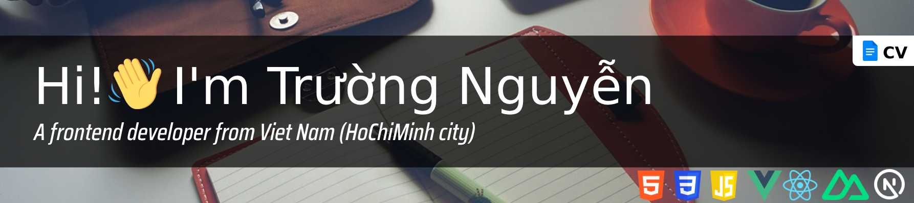

> :sunny: By failing to prepare, you are preparing to fail. But sometimes you need to choose to bear more than half the failure you've already expected, rather than doing nothing.
> 
<i>Benjamin Franklin and Robin Sharma</i>

### :handshake: Nice to meet you

As a Frontend developer with 5+ years of experience; I have necessary skills for creating, managing, maintaining and extending the frontend resources. And I regularly do research on more of them.

### :green_book: Education

- 2012 - 2017 SaiGon University - IT Software

### :briefcase: Work - [My CV is attached for your review](https://raw.githubusercontent.com/anhchangvt1994/anhchangvt1994/main/NguyenMinhTruong_Frontend_VueJS_ReactJS_NuxtJS_CV.pdf)

- 06 / 2021 - 06 / 2022 [Go2Joy company](https://go2joy.vn)

- 06 / 2018 - 06 / 2021 [Fado (Miczone Group)](https://fado.vn)

- 04 / 2017 - 06 / 2018 [Vietry Co.,LTD](https://vietry.com.vn)

### :technologist: Personal Projects

08 / 2022 - Present

- Build a Web-Frontend Boilerplate by using Webpack, Vue / React and Typescript. This project will help :
  - Provide configuration to optimize performance using Webpack (better chunk splitting, compression, formatting, syntax checking, and commit checking)
- Build a Web-Frontend Boilerplate by using Vite, Vue / React and Typescript
  - Provide configuration to optimize performance using Vite (better chunk splitting, compression, formatting, syntax checking, and commit checking)
- Build a SEO-Automated Boilerplate (a Web-Frontend Boilerplate with SEO automation ability)
  - Provide automatic SEO ability for CRS frameworks and also SSR frameworks. ( Please see more in [here](https://github.com/anhchangvt1994/vite-project-template-react__seo-web-scraping#how-it-works) to know `How it works ?`)

**Project repositories:**

1. [Web-Frontend Boilerplate - Webpack, Vue and Typescript](https://github.com/anhchangvt1994/webpack-project--template-vue-ts__react-router)
2. [Web-Frontend Boilerplate - Webpack, React and Typescript](https://github.com/anhchangvt1994/webpack-project--template-react-ts__react-router)
3. [Web-Frontend Boilerplate - Vite, Vue and Typescript](https://github.com/anhchangvt1994/vite-project--template-vue-ts__react-router)
4. [Web-Frontend Boilerplate - Vite, React and Typescript](https://github.com/anhchangvt1994/vite-project--template-react-ts__react-router)
5. [SEO-Automated Boilerplate - Webpack, Vue, Typescript, Express, Fastify and uWebSockets](https://github.com/anhchangvt1994/webpack-project-template-vue__seo-web-scraping)
6. [SEO-Automated Boilerplate - Webpack, React, Typescript, Express, Fastify and uWebSockets](https://github.com/anhchangvt1994/webpack-project-template-react__seo-web-scraping)
7. [SEO-Automated Boilerplate - Vite, Vue, Typescript, Express, Fastify and uWebSockets](https://github.com/anhchangvt1994/vite-project-template-vue__seo-web-scraping)
8. [SEO-Automated Boilerplate - Vite, React, Typescript, Express, Fastify and uWebSockets](https://github.com/anhchangvt1994/vite-project-template-react__seo-web-scraping)

**Note :**

The personal projects I listed above belong to the group of projects that build scaffolding to support web-frontend developers. It provides convenience, optimization, stability, and time-saving for developers, helping them focus more on Business  Logic, UI, and UX code. There are always templates available on the market like this, for example, when using Vue there will be VueCLI, React will have Create React App, even Vite has a repository of templates for you to choose from. And these personal projects of mine are exactly the "wheel" in the phrase "why are you reinventing the wheel?", but I am proud that I know how to make the best quality wheels for myself, and hopefully for many more people.

If you are interested in knowing more about UI/UX projects that I have participated in, you can check out the websites that I have attached in the introduction of my work process at companies, specifically at Fado and Go2joy. And some freelancer websites that I will list below.

### :technologist: Freelancer and UI/UX Projects

1. [ShopTocXinh](http://shoptocxinh.vn) - HTML, CSS, Javascript and JQuery for UI/UX
2. Opia is a personal UI/UX project, this project contains a design created by myself, and UI/UX by myself
  - [Design](https://github.com/anhchangvt1994/opiatheme)
  - [UI/UX code](https://github.com/anhchangvt1994/opia)
3. [FVNBox JQuery plugins](https://github.com/anhchangvt1994/fvnBox). This project is also a "wheel" and I have created it with all the passion of my youth, when I was just starting out in the profession.
4. VietKiem 3D - NextJS 13, styled-components, yup, React Hook Form for UI/UX

<h3>Connect information</h3>

:mailbox_with_mail: **anhchangvt1994@gmail.com**

:page_facing_up: [**CV**](https://raw.githubusercontent.com/anhchangvt1994/anhchangvt1994/main/NguyenMinhTruong_Frontend_VueJS_ReactJS_NuxtJS_CV.pdf)

:phone: **+84 (94) 862-1519**

<h3>Social information</h3>

<h3 align="left">Languages and Tools</h3>

#### Most Used
     

#### Commonly Used
       

#### Less Used

   